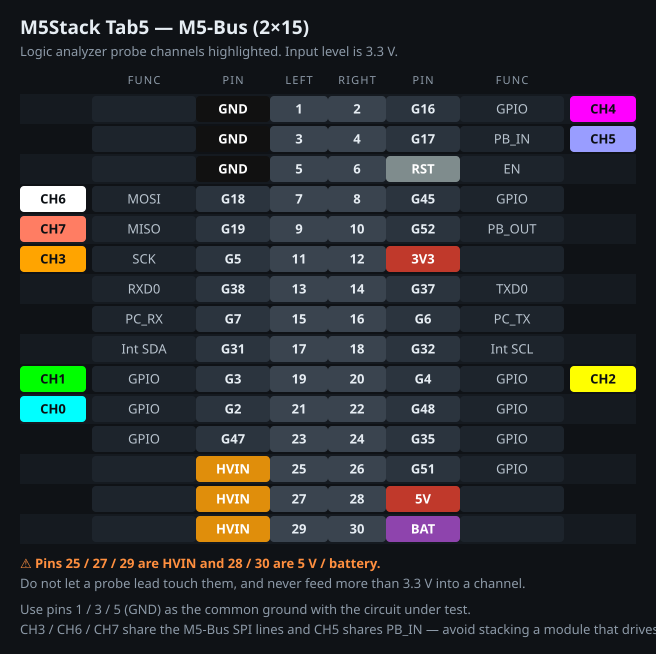

# M5Tab5 Logic Analyzer

**[📖 マニュアル (日本語)](https://airpocket-soundman.github.io/M5Tab-logic-analyzer/)** ·
[English](https://airpocket-soundman.github.io/M5Tab-logic-analyzer/en.html) ·
[中文](https://airpocket-soundman.github.io/M5Tab-logic-analyzer/zh.html)

M5Stack Tab5 (ESP32-P4) を 8ch ロジックアナライザーにするファームウェアです。
5 インチ 1280x720 タッチパネル上で、波形表示・トリガ・プロトコルデコード
(UART / I2C / SPI)・microSD へのエクスポートまで完結します。

```
+--------------------------------------------------------------+
| RUN  SINGLE   1.000 MHz   2MSa   ENG:AUTO   AUTO   PARLIO ... |
+--------+-----------------------------------------------------+
| CH0 G2 |  time ruler                                          |
| CH1 G3 | ____/‾‾‾‾\____/‾‾‾‾\____/‾‾‾‾\____                    |
| ...    | [ 55 'U' ][ A2 ][ 0F ]   <- decoder annotations       |
+--------+-----------------------------------------------------+
| CURSORS      MEASUREMENTS                    STATUS           |
+--------------------------------------------------------------+
| Zoom- Zoom+ Fit |< << >> >| Trig CurA CurB Clr | Trigger ...  |
+--------------------------------------------------------------+
```

## 機能

| 分類 | 内容 |
| --- | --- |
| 取り込み | 8ch / 1 サンプル 1 バイト / 深度 64 kSa 〜 8 MSa (PSRAM) |
| サンプリングエンジン | **PARLIO** (DMA・最大 40 MSa/s) と **CPU** (ポーリング) の 2 系統・自動選択 |
| トリガ | ch ごとに Rise / Fall / Both / High / Low、エッジは OR・レベルは AND、プリトリガ位置 0〜95% |
| トリガモード | AUTO (条件不一致でも表示) / NORMAL (一致するまで再取り込み) / SINGLE |
| 表示 | ピンチズーム・ドラッグパン・LOD による高速描画 (ズームアウトしても 1 サンプルのグリッチが消えない) |
| カーソル | A / B の 2 本、Δt と 1/Δt を表示 |
| 測定 | ch ごとに 周波数・デューティ・エッジ数・最小 High/Low 幅 |
| デコーダ | UART (オートボー対応) / I2C / SPI |
| 保存 | CSV (表示範囲) / VCD (全体・PulseView と GTKWave で開ける) / デコード結果 txt / 画面 BMP |

## 配線

プローブは Tab5 の **M5-Bus ヘッダ (2×15, 30 ピン)** に出します。



既定のピン割り当ては [include/config.h](include/config.h) の先頭にまとめてあります。

| ch | GPIO | M5-Bus ピン | 備考 |
| --- | --- | --- | --- |
| CH0 | G2  | 21 | 汎用 GPIO |
| CH1 | G3  | 19 | 汎用 GPIO |
| CH2 | G4  | 20 | 汎用 GPIO |
| CH3 | G5  | 11 | M5-Bus SPI_SCK と共用 |
| CH4 | G16 | 2  | 汎用 GPIO |
| CH5 | G17 | 4  | M5-Bus PB_IN と共用 |
| CH6 | G18 | 7  | M5-Bus SPI_MOSI と共用 |
| CH7 | G19 | 9  | M5-Bus SPI_MISO と共用 |

GND は 1 / 3 / 5 番ピンを使ってください。

> **25 / 27 / 29 番は HVIN、28 / 30 番は 5V とバッテリーです。**
> プローブのリードが触れないよう注意してください。

> **入力レベルは 3.3V です。** 5V や 12V の信号を直結すると ESP32-P4 が壊れます。
> 高い電圧を測るときは分圧か 3.3V のレベルシフタ／バッファを挟んでください。
> 未接続の ch がノイズを拾わないよう、既定で内部プルアップを有効にしています
> (`LA_PROBE_PULLUP`)。

8ch すべてを 1 つの GPIO バンク (GPIO0-31) に収めてあるので、CPU エンジンは
レジスタ 1 回読みで 8ch を取り込めます。ピンを変える場合もできるだけ
バンクをまたがないようにすると速度が落ちません。

## ビルドと書き込み

```bash
pio run -t upload
```

```bash
pio device monitor
```

PlatformIO は [pioarduino](https://github.com/pioarduino/platform-espressif32) の
ESP32-P4 対応版を使います。初回は toolchain のダウンロードで 5〜10 分かかります。

> Windows で Git Bash / MSYS から `pio` を実行すると ESP-IDF のツール
> インストーラが `MSys/Mingw is not supported` で失敗します。
> PowerShell か cmd から実行してください。

## 使い方

1. プローブを対象回路につなぎ、GND を共通にする。
2. 上段の `-` `+` でサンプリングレートと深度を決める。
   目安は **観測したい最速の信号の 5〜10 倍** のレート。
3. `Trigger` でトリガ条件を設定する (ch をタップするたびに条件が一巡します)。
4. `RUN` で連続取り込み、`SINGLE` で 1 回だけ取り込み。
5. 波形はドラッグでパン、2 本指ピンチでズーム。タップするとアクティブな
   カーソル (`Cur A` / `Cur B`) がその位置に置かれます。
6. `Decode` でプロトコルを選び、ch を割り当てて `Decode now`。
7. `Save` から microSD に書き出し。

詳しい操作は **[オンラインマニュアル](https://airpocket-soundman.github.io/M5Tab-logic-analyzer/)**
(日本語 / English / 中文) を参照してください。
[docs/USAGE.md](docs/USAGE.md)、[docs/API.md](docs/API.md)、
[docs/ARCHITECTURE.md](docs/ARCHITECTURE.md) にも同じ内容があります。

## 実測性能

M5Stack Tab5 実機 (ESP32-P4 rev v1.3 / 360 MHz / PSRAM 32MB) での測定値です。
内蔵テスト信号発生 (`gen` コマンド) で CH0 に 1 MHz 方形波を出し、
深度 2 MSa で取り込んだときの結果:

| 要求レート | 実効レート | 取り込み | 1MHz の測定値 | 誤差 | コピー ISR 占有 |
| ---: | ---: | ---: | ---: | ---: | ---: |
| 20 MSa/s | 20.00 | 2097152 | 1.00 MHz | 0.00% | 20% |
| 22.86 MSa/s | 22.86 | 2097152 | 1.00 MHz | 0.00% | 22% |
| **26.67 MSa/s** | **26.67** | 2097152 | 1.00 MHz | 0.00% | **26%** |
| 32 MSa/s | 32.00 | 2097152 | 1.00 MHz | 0.00% | 31% |
| 40 MSa/s | 40.00 | 2097152 | 1.00 MHz | 0.00% | 39% |
| 53.33 MSa/s | 53.33 | 2097152 | 1.00 MHz | 0.00% | 52% |
| 80 MSa/s | 80.00 | 2097152 | 1.00 MHz | 0.00% | 77% |

**2000 円クラスの FX2LP 系ロジアナ (24 MSa/s 8ch) を上回ります。**
26.67 MSa/s でコピー ISR の占有率はわずか 26%、深度も 2 MSa まで確認済みです。
エッジ数も理論値と一致しているため、取りこぼしはありません。

80 MSa/s も動作しますが ISR 占有 77% と余裕がないため、常用は **40 MSa/s 以下**
を推奨します。占有率が 80% を超えると `OVERRUN RISK` と表示されます。

### 入力周波数の実測

内蔵ジェネレータで CH0 に方形波を出し、80 MSa/s・深度 131072 で取り込んだ結果です。

| 発生周波数 | 1 周期あたり | 測定値 | エッジ数 | 判定 |
| ---: | ---: | ---: | ---: | --- |
| 1.00 MHz | 80 サンプル | 1.00 MHz | 3279 | 理論値と一致 |
| 1.95 MHz | 40 サンプル | 1.95 MHz | 6379 | 一致 |
| 4.91 MHz | 16 サンプル | 4.91 MHz | 16092 | 一致 |
| 9.74 MHz | 8 サンプル | 9.74 MHz | 31908 | 一致 |
| 12.96 MHz | 6 サンプル | 12.96 MHz | 42449 | 一致 |
| **19.44 MHz** | **4.1 サンプル** | **19.44 MHz** | **63695 / 63696** | 2 回連続で一致 |

19.44 MHz まで、エッジ数が理論値と一致した状態で取り込めています。
表の「発生周波数」が半端なのは、LEDC の分周が小数になるためで、
アナライザ側の誤差ではありません (同じ値が繰り返し再現します)。

> **19.44 MHz より上は未測定です。** 内蔵 LEDC がそれ以上の周波数を生成できず、
> 外部の信号源が必要なためです。ペリフェラル側の上限ではありません。

### チャンネルマッピングの検証

内蔵ジェネレータで 1 MHz を 1 ch ずつ順に出し、20 MSa/s・深度 131072 で取り込んだ結果。
理論エッジ数は 13107 (131072 / 20e6 * 2e6)。

| 駆動 ch | GPIO | 反応した ch | 測定値 | エッジ数 |
| --- | --- | --- | ---: | ---: |
| CH0 | G2  | CH0 のみ | 1.00 MHz | 13106 |
| CH1 | G3  | CH1 のみ | 1.00 MHz | 13107 |
| CH2 | G4  | CH2 のみ | 1.00 MHz | 13111 |
| CH3 | G5  | CH3 のみ | 1.00 MHz | 13111 |
| CH4 | G16 | CH4 のみ | 1.00 MHz | 13114 |
| CH5 | G17 | CH5 のみ | 1.00 MHz | 13107 |
| CH6 | G18 | CH6 のみ | 1.00 MHz | 13111 |
| CH7 | G19 | CH7 のみ | 1.00 MHz | 13111 |

チャンネルの入れ替わりもクロストークもありません。

トリガも実機で確認済みです。`ch3=rise` / プリトリガ 25% でトリガ位置 32770
(境界の 32768 直後)、アイドル線に `ch5=rise` を掛けると `-1` (誤発火なし)。

### CPU エンジンの実力

5 MSa/s を要求して **実測 2.811 MSa/s**。200 kHz の信号を 200.06 kHz と測定
(誤差 0.03%) するので、実測レートを返す設計どおり時間軸は正しいままです。
1 サンプルあたり約 128 サイクルで、PSRAM への書き込みがコストを支配しています。
**CPU エンジンは 2.8 MSa/s 程度が上限**とみてください。PARLIO が使えない場合の
フォールバックであり、常用するものではありません。

### 呼称について

| 表記 | 値 | 根拠 |
| --- | --- | --- |
| **サンプリングレート** | **80 MSa/s** (8ch 同時) | 実測。エッジ数が理論値と一致 |
| 常用推奨レート | 40 MSa/s 以下 | 80 MSa/s はコピー ISR 占有 77% で余裕がない |
| 最小検出パルス幅 | 12.5 ns @ 80 MSa/s | 1 サンプル周期 |
| 測定確認済み入力周波数 | 19.44 MHz | 上記の実測。これ以上は未測定 |
| 実用的な信号周波数 | 8〜20 MHz | 5〜10 倍のオーバーサンプリングを確保する場合 |

格安ロジアナが「24MHz」と名乗るときの 24 はサンプリングレートなので、
同じ流儀なら本機は **80MHz 相当**です。ただし「80 MHz の信号が測れる」と
誤読されるため、**`80 MSa/s` と単位まで書くことを推奨します。**

### 取り込みモード

| モード | 条件 | 特徴 |
| --- | --- | --- |
| **direct** | 深度 ≤ 191 kSa | 取り込み中は一切コピーしない。リアルタイム制約ゼロで、レートはペリフェラルの上限まで出せる |
| **stream** | 深度 > 191 kSa | ディスクリプタ完了ごとに PSRAM へコピー。コピーがサンプルレートに追従する必要がある |

### 制約

- **レートは 160 MHz の整数分周**でしか出せません (80 / 53.33 / 40 / 32 / 26.67 /
  22.86 / 20 ...)。メニューはこの実現可能な値で構成してあります。24 MHz ちょうどは
  出せないため、上側の 26.67 MHz を使ってください。
- **時間軸はハードウェア分周値をそのまま使います。** 壁時計で測るとアーミングと
  停止処理の分だけ ~1% 伸びるため、そちらは診断用にのみ表示しています。
- **CPU エンジン**: サイクルカウンタでペーシングしたポーリングループ。
  実測レートを表示するので時間軸は正しいままですが、2 ms ごとに割り込みを
  一瞬開ける区切りが入ります (ウォッチドッグと FreeRTOS tick を生かすため)。
  PARLIO が使えない場合のフォールバックです。
- **トリガはソフトウェア検索です。** バッファを埋めてから条件を探すため、
  NORMAL モードは「取り込み → 検索 → 見つからなければ再取り込み」を
  タイムアウトまで繰り返します。周期的な信号には十分ですが、めったに
  起きない単発イベントは取り逃す可能性があります。

## リモート制御 API

USB CDC (書き込みに使うのと同じポート) が行指向の制御 API になっています。
1 行送ると JSON が 1 行返る同期プロトコルです。詳細は [docs/API.md](docs/API.md)。

```
> gen ch=0 freq=1000000 duty=50
{"ok":true,"gen":"on","ch":0,"pin":2,"freq":1000000,"duty":50,"res_bits":5}
> config engine=parlio rate=26666666 depth=2097152
> single
> stats
{"ok":true,"sec_per_sample":3.75e-08,"stats":[{"ch":0,"edges":157286,"freq":1000000,...
```

外部信号源がなくても `gen` コマンドでプローブピンに既知の方形波を出せるので、
配線なしで動作確認ができます。

## テスト用信号源 (AtomS3)

実機検証には M5Stack AtomS3 を独立した信号源として使えます
([tools/atoms3-siggen](tools/atoms3-siggen))。本体内蔵の `gen` は同じチップが
自分自身を駆動するのに対し、こちらは**別のクロックを持つ別基板が実配線を駆動**
するので、外部経路まで含めた検証になります。

```bash
pio run -d tools/atoms3-siggen -t upload
```

| AtomS3 | Tab5 | | AtomS3 | Tab5 |
| --- | --- | --- | --- | --- |
| G1 | CH0 (G2) | | G6 | CH3 (G5) |
| G2 | CH1 (G3) | | G7 | CH4 (G16) |
| G5 | CH2 (G4) | | G8 | CH5 (G17) |
| GND | GND (M5-Bus 1/3/5) | | | |

USB CDC 経由でアナライザと同じ書式のコマンドを受けます。

```
square [pin=<gpio>] freq=100000 [duty=50]
uart   [pin=<gpio>] baud=115200 [text=M5Tab5]
counter period=<us>     6 本同時の同期バイナリカウンタ
spi    [clk_hz=] [bytes=]
off
```

`counter` は全ピンを同一命令で書き換えるため、**チャンネル間の同時性**を検証できます。

## ドキュメントの再生成

マニュアルは 1 つのシェル (CSS / JS / レイアウト) を 3 言語で共有する構成で、
`docs_src/` から生成します。

```bash
python docs_src/build.py
```

スクリーンショットは実機と同じ UI コードを WebAssembly でビルドして生成しています
(モックではありません)。再生成するには
[web-simulator-for-lvgl](https://github.com/airpocket-soundman/web-simulator-for-lvgl)
を隣に置いて:

```bash
pwsh sim/tools/build_shots.ps1
```

M5-Bus のピン配置図は `python sim/tools/make_pinout.py > docs/img/m5bus-pinout.svg` で
再生成できます。

## ライセンス

MIT
